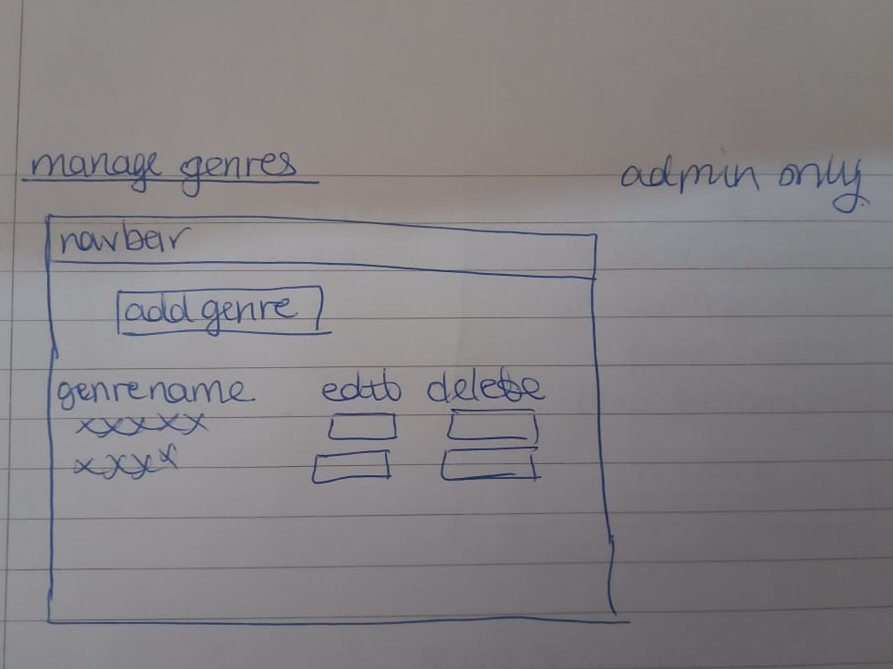

# Bookworm

[Link to live project.](https://bookworm-maya.herokuapp.com/)

This is a website for a book review/recommendation site.  

It is aimed for those who are interested in getting book recommendaions based on author, genre or trying something completely new, users can also help others by providing reviews of books they have read themselves. 

Mockups:

## Table of Contents

* [UX](#ux)
  * [User Stories](#user-stories)
    * [First Time Visitor Goals](#first-time-visitor-goals)
    * [Returning Visitor Goals](#returning-visitor-goals)
    * [Frequent User Goals](#frequent-user-goals)
  * [Strategy](#strategy)
    * [Business Goals](#business-goals)
    * [User Goals](#user-goals)
  * [Scope](#scope)
  * [Structure](#structure)
   * [Wireframes Navbar](#wireframes-navbar)
   * [Wireframes Home](#wireframes-home)
   * [Wireframes Login](#wireframes-login)
   * [Wireframes Register](#wireframes-register)
   * [Wireframes New and Edit Review](#wireframes-new-edit-review)
   * [Wireframes Manage Books](#wireframes-manage-books)
   * [Wireframes New and Edit Book](#wireframes-add-edit-book)
   * [Wireframes Manage Genres](#wireframes-manage-genres)
   * [Wireframes New and Edit Genre](#wireframes-add-edit-genre)
  * [Skeleton](#skeleton)
    * [Colours](#colours)
    * [Imagery](#imagery)
  * [Surface](#surface)
* [Features](#features)
    * [Existing Features](#existing-features)
    * [Features Left to Implement](#features-left-to-inplement)
* [Technologies Used](#technologies-used)
* [Testing](#testing)
  * [User Authentication Register](#user-authentication-register)
  * [User Authentication Log In](#user-authentication-log-in)
  * [User Authentication Log Out](#user-authentication-log-out)
  * [View Reviews](#view-reviews)
  * [Add New Review](#add-new-review)
  * [Edit Review](#edit-review)
  * [Delete Review](#delete-review)
  * [Manage Books](#manage-books)
  * [Add Book](#add-book)
  * [Edit Book](#edit-book)
  * [Delete Book](#delete-book)
  * [Manage Genres](#manage-genres)
  * [Add Genre](#add-genre)
  * [Edit Genre](#edit-genre)
  * [Delete Genre](#delete-genre)
  * [Online Validation](#online-validation)
  * [Lighthouse Validation](#lighthouse-validation) 
  * [User Stories from the UX Section](#user-stories-from-the-ux-section)
* [Deployment](#deployment)
  * [Creation](#creation)
  * [Heroku](#heroku)
  * [Local Clone](#local-clone)
  * [Forking](#forking)
* [Credits](#credits)
  * [Code](#code)
  * [Content](#content)
  * [Media](#media)
  * [Acknowledgments](#acknowledgments)

## UX

### User Stories

#### First Time Visitor Goals

* As a first time user, I want to know the purpose of the site.

* As a first time user, I want to read reviews registered users have made.

* As a first time user, I want to be able to find a new book that I may like to read.

* As a first time user, I want to be able to be able to search in the reviews for a certain book title or author.

#### Returning Visitor Goals

* As a returning user, I have similar needs of a first time user.

* As a returning user, I want to be able to register and login as myself.

* As a returning user, I want to be able to add new books to the database/site.

* As a returning user, I want to be able to add my own reviews to the site, I would also like to update or delete my own reviews.

#### Frequent User Goals

* As a frequent user, I have similar needs of a first time and returning user.

### Strategy

#### Business goals

* As a business owner I want to, help users find new books/authors they may enjoy.

* As a business owner I want to, be able to manage the list of books and genres that are displayed as options to users of the site when adding a new review or book to the database/site.

* As a business owner I want to, be able to manage the reviews and soft delete any that are deemed spam or unacceptable in some way, this will be a soft delete and will remain in the database but not be shown on the site to users.

#### User Goals

* To read reviews and gain information about new books/authors they may like.

* To help the community by providing reviews for books they have read.

* To have the ability to update or delete a review I have made.

### Scope

Key features to be included based on user stories are:

* Responsive website on mobile, tablet and laptop size devices.

* The home page will contain the reviews and a search bar for users to search for a book title or author. 

* The login page will contain a form for registered users to login.

* The register page will contain a form for new members to sign up and be part of the community.

* The new review page will contain a form which allows signed in users to create a new review for a book.

* The manage books page will contain a list of all current books in the database, this will be accessible to admin only.

* The manage genres page will contain a list of all current genres in the database, this will be accessible to admin only.

### Structure

All pages of the website will have a consistent navigation bar. The home, login and register links will be available to users who aren't yet registered and/or logged into the site. For non admin users when logged in this will show home, new review, add books and logout links. For admin users when logged in users this will show home, new review, manage books, manage genres and logout links. 

The website will use Materializecss grids to make the layout responsive to different devices and screen sizes.

* The home page will contain the reviews and a search bar for users to search for a book or author. Signed in users can update or delete their own reviews, this will only be a soft delete and the information will remain in the database but not be shown on the site to users. Admin are able to delete any review they deem spam or unacceptable in some way, this again will be a soft delete only.

* The login page will contain a form for registered users to login. This will ask for username and password, if either are incorrect this will be displayed ot the user and the site will ask them to try again. There will also be a logout link for logged in users to use.

* The register page will contain a form for new members to sign up and be part of the community. This will ask for users username, password, age category and gender. The site will check against the database to make sure there is no current user with such username and if so will notify the user as such and to choose a different username instead. Age category and gender can be of use for users of the site when deciding on a new book/author based on demogrpahics of those who read such books/authors' work.

* The new review page will contain a form which allows signed in users to create a new review for a book. This will include a dropdown for the book that is being revewed, recommend yes/no field, start out of 5 field and review comment (free text field). Users will also be able to update/delete their own review and admin can delete any review.

* The manage books page will contain a list of all current books in the database. This will be accessible to admin only and allow them to view all books in the database and a links which allow them to a new book and update/delete an existing one. Users who are not admin and logged in will be able to add a new book to the database but not update or delete any existing ones.

* The manage genres page will contain a list of all current genres in the database. This will be accessible to admin only and allow them to view all genres in the database and a links which allow them to add a new genre and update/delete an existing one.

### Skeleton

I used pen and paper to make the wireframes for this project. The website was designed to have 11 pages - Home, Login, Register, New Review, Edit Review, Manage Books, Add Book, Edit Book, Manage Genres, Add Genre and Edit Genre. The webiste also includes a logout link which logs out signed in users and takes them to the home page.

#### Wireframes Navbar

  

#### Wireframes Home

  

#### Wireframes Login

 

#### Wireframes Register

 

#### Wireframes New and Edit Review

  

#### Wireframes Manage Books

 

#### Wireframes Add and Edit Book

  

#### Wireframes Manage Genres

 

#### Wireframes Add and Edit Genre

  

#### Wireframes Comments

Please note there are a few changes to the final site since the wireframes were made:

  * Change 1
  * Change 2

### Surface

#### Colours
I noticed that several booksites seem to use a common colour of blue e.g. [Waterstones](https://www.waterstones.com/) and [World of Books](https://www.worldofbooks.com/en-gb), however I chose a main colour of green as I found this a good colour to represent nature/balance and is also calming. From [Adobe Color](https://color.adobe.com/create/color-wheel) I choose green (#00e676 green accent-3) as the main colour and this site helped me find the split complemantary colours of orange (#ef6c00 orange darken-3) and magenta (#ad1457 pink darken-3). For the navbar and headings text I chose a light (#b9f6ca green accent-1) and dark green (#1b5e20 green darken-4) and other text uses dark grey (#424242 grey darken-3).

#### Imagery
I picked images of books and people reading books, I also wanted to pick images that created a sense of relaxation and calm (so a few of the images are of people reading outside). The images used on the site are credited in the credits - media section of this readme.

## Features

### Existing Features

* The site is responsive on mobile, tablet and laptop size devices.

* The home page contains information of all genres, books and reviews from the database. Users can click on a book to see the reviews on it. With each book the average score out of 5 is displayed with the number of reviews in brackets. A user who created a review is able to edit or delete it when they are logged in. This page also includes a search function where users can search for a book based on its title or the author name. This page also has prompts for a user to add new books/reviews to the site to help it grow.

* The login page allows registered users to log in with their username and password.

* The register page allows unregistered users to register with the site by giving a username, their age category, their gender and choosing a password.

* The new review page allows logged in users to add a review for one of the books already in the database/site. They can say if they recommend it or not, give stars out of 5 and also a review comment to guide other users who view the site into picking new books/authors to read.

* The manage books page is restricted to admins only. It allows admin to view the current books and add a new book to the site, update a book or delete a book. Users who are not admin and who are logged in can also add new books but are not able to update or delete existing records.

* The manage genres page is restricted to admins only. It allows admin to view the current genres and add a new genre to the site, update a book or delete a genre.

* Before a user/admin deletes a review, book or genre there is defensive programming which will display additional buttons to check if a user/admin really wants to delete the review, book or genre. 

* When a user/admin deletes a review, book or genre this is a soft delete only and the information is kept in the database but the variable "display" will change to "N" (for all reviews, books and genres this is automatically set to "Y" on creation) and therefore this information will not be presented on the site.

* There a security checks so a user cannot gain access to cetrain pages without being logged in or logged in as admin.
  * All users can access register, log in and home pages.
  * Logged in users also gain access to add review and add book pages.
  * Admin users also gain access to manage books, manage genres and add genre pages.
  * There are no security checks for edit review, edit book and edit genre pages as these would require a user to guess the review/book/genre id (as in mongobd) and therefore are secure. For example to edit a review the page would be something like ".../edit_review/613faa0a95b25ad59fd7731c".
  * If a user tries to access a page they are not allowed to some text will be shown like below.  
  Try and go to http://bookworm-maya.herokuapp.com/add_review before logging in and you will get the below warning:  
  
  Try and go to http://bookworm-maya.herokuapp.com/get_genres before logging in and you will get the below warning:  
  

### Features Left to Implement

* It would be nice to use some book API, for example [Google Books](https://developers.google.com/books/docs/v1/using), as this could help ensure the spelling of book titles and authors are correct when users add a new book to the site/database (and help avoid having duplicates of the same bok with various spellings of title/author). This could have the users enter a book they have using the ISBN number (usually found on the back of the book near the barcode) or if they do not have the book to hand they could be prompted to google for its ISBN number or contact the site with the details so a person could manually add it to the site/database. 

* It would be nice to have a check when a user adds a new review to see if they have already made a review for that book - if yes we could prompt them to edit this review instead.

* It would be nice to have a search function on the manage books page so admin check if a book exists in the database before adding a new one.

* It would be good to have the site collect a users date of birth when they register rather than collecting age category directly. The site could calculate their age at a given time using this date of birth and the system date to derive age and age category. This would be good for instances when a user's age and age category will change over time and it can be automaticaly updated when they make a review.

* If a book title is updated it would be good to automatically update the book_title variable in the reviews collection to make sure all the reviews should show correctly. Similarly if a genre name is updated it would be good to automatically update the genre_name variable in the books collection to make sure all books should show correctly.

## Technologies Used

* HTML - used to create the main content for the website.

* CSS - used to add style and colour to the content.

* [Materializecss](https://materializecss.com/)
  * Used to help make this website responsive for different devices and to create the collapsible navbar.
  * Used to make the cards on the home page reveal the review details for each book.
  * Used to help create the colours and style on the site. 
  * Used to validate user information in the add/edit review forms. 

* Javascript - used to help make the site responsive to the user's input - defensive programming before deleting a review, book or genre to check if the user is sure they want to proceed.

* jQuery - used to help make the site responsive to the user's input - defensive programming before deleting a review, book or genre to check if the user is sure they want to proceed.

* [MongoDB](https://www.mongodb.com/) used to create, store and update the data used in this site.

* [Python](https://www.python.org/) and [Flask](https://flask.palletsprojects.com/en/2.0.x/) - used to get data from the database in MongoDB to the live site.

* [Werkzeug](https://werkzeug.palletsprojects.com/en/2.0.x/) - used to create the security on the site allowing users to register, log in and logout of their own profiles. It also helped make the user authentication more secure by converting the users password into a random string of letters/numbers before saving this in the database (using the generate_password_hash and check_password_hash functions). 

* [Gitpod](https://www.gitpod.io/) - used to write the code for the website.

* [GitHub](https://github.com/) - used to store the current and previous versions of the code. 

* [Heroku](https://www.heroku.com/) - used to host the live website.

* [Tinypng](https://tinypng.com/) - used to compress the images so they loaded quicker on the website.

* [Am I Responsive](http://ami.responsivedesign.is/#) - used for the mockups of the website on different devices.

## Testing

### General text for testing section

Worked as planned:

Expected - When the user does x the site should do y.

Testing - Tested the feature by going doing x.

Result - The feature acted as normally and it did y.

Didnt work as planned:

Expected - When the user does x the site should do y.

Testing - Tested the feature by going doing x.

Result - The feature did not act as expected and it did z. I did a to test, noticed problem b, once I corrected this by doing c I retested and the feature acted as expected and it did y.

### User Authentication Register

### User Authentication Log In

### User Authentication Log Out

### View Reviews

- loop show "sorry no reviews text" or show all the reviews in its own loop
- average review created a separate dictionary in python file to derive the average review for each book so this could be used in reviews.html page.
- when searching error as couldnt find averageRev1 dictionary, I had to add the code to make this dictionary as above in this section of the python file.

### Add New Review

- date created variable in right format used https://www.w3schools.com/python/python_datetime.asp to help me get this format how I wanted it.

### Edit Review

- issue with date_created field being overwirtten with a value of "", had to get the value from the database and save as a variable to then include it when updating the review document in the mongodb collection.

### Delete Review

### Manage Books

### Add Book

### Edit Book

### Delete Book

### Manage Genres

### Add Genre

### Edit Genre

### Delete Genre

### Online Validation

* I checked the website loads and responds as expected on Google Chrome, Internet Explorer and Microsoft Edge browsers. 

* Used chrome developer tools and [responsinator](https://www.responsinator.com/) to check responsiveness on mobile, tablet and laptop devices.  
I also checked the website on my HP 15 inch laptop, Philips 20 inch monitor and Sony smartphone.

* Used the [w3c validator](https://validator.w3.org/) to validate my html (for both pages of the website) to check for no errors or warnings. 
* Used the [jigsaw validator](https://jigsaw.w3.org/css-validator/#validate_by_input) to validate my style.css file to check for no errors or warnings. 
I did not validate css of the whole website as this included the imported materializecss files.

* Used [Jshint](https://jshint.com/) to validate my js files and ensure no warnings or errors.

* Used [PEP8 Online](http://pep8online.com/) to validate my python files and ensure no warnings or errors.

### Lighthouse Validation

I used [lighthouse](https://developers.google.com/web/tools/lighthouse) in chrome developer tools to check the websites performance in terms of 
performance, accessibility, best practises and SEO.
This was done for both pages of the website and for both mobile and desktop devices.
The summary table below shows these metrics.

| Device | Page |  Performance | Accessibility  | Best Practises  | SEO |
|---|---|---|---|---|---|
| Mobile  |  Home | xx% | xx% | xx% | xx% |
| Mobile  |  Login | xx% | xx% | xx% | xx% |
| Mobile  |  Register | xx% | xx% | xx% | xx% |
| Mobile  |  New Review | xx% | xx% | xx% | xx% |
| Mobile  |  Edit Review | xx% | xx% | xx% | xx% |
| Mobile  |  Manage Books | xx% | xx% | xx% | xx% |
| Mobile  |  Add Book | xx% | xx% | xx% | xx% |
| Mobile  |  Edit Book | xx% | xx% | xx% | xx% |
| Mobile  |  Manage Genres | xx% | xx% | xx% | xx% |
| Mobile  |  Add Genre | xx% | xx% | xx% | xx% |
| Mobile  |  Edit Genre | xx% | xx% | xx% | xx% |

| Desktop  |  Home | xx% | xx% | xx% | xx% |
| Desktop  |  Login | xx% | xx% | xx% | xx% |
| Desktop  |  Register | xx% | xx% | xx% | xx% |
| Desktop  |  New Review | xx% | xx% | xx% | xx% |
| Desktop  |  Edit Review | xx% | xx% | xx% | xx% |
| Desktop  |  Manage Books | xx% | xx% | xx% | xx% |
| Desktop  |  Add Book | xx% | xx% | xx% | xx% |
| Desktop  |  Edit Book | xx% | xx% | xx% | xx% |
| Desktop  |  Manage Genres | xx% | xx% | xx% | xx% |
| Desktop  |  Add Genre | xx% | xx% | xx% | xx% |
| Desktop  |  Edit Genre | xx% | xx% | xx% | xx% |

Full reports can be found below:
* [Mobile Home](assets/lighthouse/lighthouse-mobile-home.pdf)
* [Mobile Login](assets/lighthouse/lighthouse-mobile-login.pdf)
* [Mobile Register](assets/lighthouse/lighthouse-mobile-register.pdf)
* [Mobile New Review](assets/lighthouse/lighthouse-mobile-new-review.pdf)
* [Mobile Edit Review](assets/lighthouse/lighthouse-mobile-edit-review.pdf)
* [Mobile Manage Books](assets/lighthouse/lighthouse-mobile-manage-books.pdf)
* [Mobile Add Book](assets/lighthouse/lighthouse-mobile-add-book.pdf)
* [Mobile Edit Book](assets/lighthouse/lighthouse-mobile-edit-book.pdf)
* [Mobile Manage Genres](assets/lighthouse/lighthouse-mobile-manage-genres.pdf)
* [Mobile Add Genre](assets/lighthouse/lighthouse-mobile-add-genre.pdf)
* [Mobile Edit Genre](assets/lighthouse/lighthouse-mobile-edit-genre.pdf)

* [Desktop Home](assets/lighthouse/lighthouse-desktop-home.pdf)
* [Desktop Login](assets/lighthouse/lighthouse-desktop-login.pdf)
* [Desktop Register](assets/lighthouse/lighthouse-desktop-register.pdf)
* [Desktop New Review](assets/lighthouse/lighthouse-desktop-new-review.pdf)
* [Desktop Edit Review](assets/lighthouse/lighthouse-desktop-edit-review.pdf)
* [Desktop Manage Books](assets/lighthouse/lighthouse-desktop-manage-books.pdf)
* [Desktop Add Book](assets/lighthouse/lighthouse-desktop-add-book.pdf)
* [Desktop Edit Book](assets/lighthouse/lighthouse-desktop-edit-book.pdf)
* [Desktop Manage Genres](assets/lighthouse/lighthouse-desktop-manage-genres.pdf)
* [Desktop Add Genre](assets/lighthouse/lighthouse-desktop-add-genre.pdf)
* [Desktop Edit Genre](assets/lighthouse/lighthouse-desktop-edit-genre.pdf)

### User Stories from the UX Section

* First Time Visitor Goals  

  * As a first time user, xxxxx.
    * How the site achieves this goal.

* Returning Visitor Goals

  * As a returning user, xxxxx.
    * How the site achieves this goal.

* Frequent User Goals
    
  * As a frequent user, xxxxx.
    * How the site achieves this goal.

* Business Goals

  * As a business I want, xxxx.
    * How the site achieves this goal.

## Deployment

### Creation

* All code was written in Gitpod and used [this template](https://github.com/Code-Institute-Org/gitpod-full-template) from Code Institute.
* Files were added to the staging area using "git add ."
* Files were committed to the local repository using "git commit -m 'commit message here'".
* Committed changes were pushed to the GitHub repository.

### Heroku

To deploy the project to a live website the below steps were followed:

* Add in steps here for Heroku deployment.

### Local Clone
To make a local copy of a repository on your own GitHub account you can clone it.
This allows others to view the original code and/or make changes to it (on their own local copy).
Changing the code on your local repository will not affect the original code or deployed website.

To clone a repository in GitHub you can follow the steps below:
* Log into GitHub and locate the repository you wish to clone.
* Click on the code button (to the left of the green Gitpod button) and copy the https URL given.
* Open Gitpod (or another editor if you prefer).
* Use the "git clone 'insert copied URL here'" command.
* A clone of the original repository will now be available for you locally 
on your own repository to view/edit as you wish.

### Forking

Forking is another way to  make a local copy of a repository on your own GitHub account to do this follow the below steps:

* Log into GitHub and locate the repository you wish to fork.
* At the top-right of the repository (and top-right of the green Gitpod button), locate the fork button.
* A copy of the original repository will now be available for you locally 
on your own repository to view/edit as you wish.

## Credits

### Code

* The Materializecss library was used to help make this website responsive for different devices and to create the collapsible navbar. 

* The Materializecss library was also used to make the cards on the home page reveal the review details for each book. 

* The Materializecss library was also used to help create the colours and style on the site.

* The Materializecss library was also used to validate user information in the add/edit review forms. 

* For the reviews I wanted to extract and display the date of each review's creation and most recent update based on the systems datetime, for this I used the code at [w3schools](https://www.w3schools.com/python/python_datetime.asp) to help me extract, format and store the dates as I wanted.

### Content

* For each of the genres I used the genres that are displayed on the popular book site [Waterstones](https://www.waterstones.com/). 

* For each of the books I added books I own to the database and made up my own reviews based on my own thoughts and what others online say about the books.

* For the general layout of the site I had a look at popular sites [Amazon](https://www.amazon.co.uk/) and [Waterstones](https://www.waterstones.com/) to see the layout of how reviews are displayed and get inspiration for style/colour themes. These sites also helped me make up fictional reviews for a range of books to be displayed on the site.

* I used images from online, information below in the media section.

### Media

* I found the following image online from [blah](): 
  * image-x - owner xxxxx [image link here]()
  
### Acknowledgments

* Code Institute for teaching me the basics of HTML, CSS, Materializecss, JavaScript, jQuery, Python, MongoDB and Flask to allow me to create this website.

* My mentor Antonio Rodriguez who helped provide feedback on this website and improvements that could be made.

* The Slack community for providing support throughout the course so far.  

* Thanks to the fellow students on Slack and my friends who viewed the website and gave feedback on any improvements/changes that could be made. 

* The websites that I used to gain inspiration for creating my own book review site: [Amazon](https://www.amazon.co.uk/) and [Waterstones](https://www.waterstones.com/).