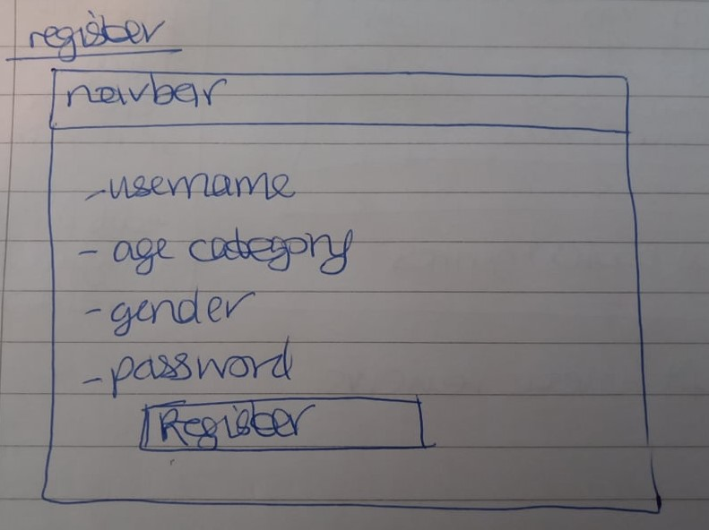
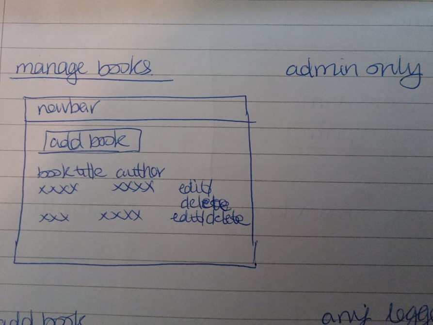

# Bookworm

[Link to live project.](https://bookworm-maya.herokuapp.com/)

This is a website for a book review/recommendation site.  

It is aimed for those who are interested in getting book recommendaions based on author, genre or trying something completely new, users can also help others by providing reviews of books they have read themselves. 

Mockups:

## Table of Contents

* [UX](#ux)
  * [User Stories](#user-stories)
    * [First Time Visitor Goals](#first-time-visitor-goals)
    * [Returning Visitor Goals](#returning-visitor-goals)
    * [Frequent User Goals](#frequent-user-goals)
  * [Strategy](#strategy)
    * [Business Goals](#business-goals)
    * [User Goals](#user-goals)
  * [Scope](#scope)
  * [Structure](#structure)
   * [Wireframes Home](#wireframes-home)
   * [Wireframes Login](#wireframes-login)
   * [Wireframes Register](#wireframes-register)
   * [Wireframes New Review](#wireframes-new-review)
   * [Wireframes Manage Books](#wireframes-manage-books)
   * [Wireframes Manage Genres](#wireframes-manage-genres)
  * [Skeleton](#skeleton)
    * [Colours](#colours)
    * [Imagery](#imagery)
  * [Surface](#surface)
* [Features](#features)
    * [Existing Features](#existing-features)
    * [Features Left to Implement](#features-left-to-inplement)
* [Technologies Used](#technologies-used)
* [Testing](#testing)
  * [User Authentication](#user-authentication)
  * [View Reviews](#view-reviews)
  * [Add New Review](#add-new-review)
  * [Update Current Review](#update-current-review)
  * [Delete Review](#delete-review)
  * [Manage Books](#manage-books)
  * [Manage Genres](#manage-genres)
  * [Online Validation](#online-validation)
  * [Lighthouse Validation](#lighthouse-validation) 
  * [User Stories from the UX Section](#user-stories-from-the-ux-section)
* [Deployment](#deployment)
  * [Creation](#creation)
  * [Heroku](#heroku)
  * [Local Clone](#local-clone)
  * [Forking](#forking)
* [Credits](#credits)
  * [Code](#code)
  * [Content](#content)
  * [Media](#media)
  * [Acknowledgments](#acknowledgments)

## UX

### User Stories

#### First Time Visitor Goals

* As a first time user, I want to know the purpose of the site.

* As a first time user, I want to read reviews registered users have made.

* As a first time user, I want to be able to find a new book that I may like to read and sort the reviews based on the average rating.

* As a first time user, I want to be able to be able to search in the reviews for books by a certain author or of a certain genre I like.

#### Returning Visitor Goals

* As a returning user, I similar needs of a first time user.

* As a returning user, I want to be able to register and login as myself.

* As a returning user, I want to be able to add my own books to the site.

* As a returning user, I want to be able to add my own reviews to the site, I would also like to update or delete my own reviews.

#### Frequent User Goals

* As a frequent user, I want to be able to see my own reviews at the top for easy management needs to update/delete.

### Strategy

#### Business goals

* As a business owner I want to, help users find new books/authors they may enjoy.

* As a business owner I want to, help companies sell more books based on this review site and help users by providing a link to where they can buy the books.

* As a business owner I want to, be able to manage the list of book genres that are displayed as options to users of the site when adding a new book to the database/site.

* As a business owner I want to, be able to manage the reviews and soft delete any that are deemed spam or unacceptable in some way, this will be a soft delete and will remain in the database but not be shown on the site to users.

#### User Goals

* To read reviews and gain information about new books/authors they may like.

* To help the community by providing reviews for books they have read.

* To have the ability to update or delete a review I have made.

### Scope

Key features to be included based on user stories are:

* Responsive website on mobile, tablet and laptop size devices.

* The home page will contain the reviews and a search bar for users to search for a book or author. Signed in users will also see their own reviews displayed at the top.

* The login page will contain a form for registered users to login.

* The register page will contain a form for new members to sign up and be part of the community.

* The new review page will contain a form which allows signed in users to create a new review for a book.

* The manage books page will contain a list of all current books in the database and a link which allows signed in users to add a new book to the database/site.

* The manage genres page will contain a list of all current genres in the database, this will be accessible to admin only.

### Structure

All pages of the website will have a consistent navigation bar. The home, login and register links will be available to users who aren't yet registered and/or logged into the site. For logged in users this will show home, new review, manage books, manage genres and logout links. Note the manage genres link will only be available to the Admin of the site and no other users.

The website will use Materializecss grids to make the layout responsive to different devices and screen sizes.

* The home page will contain the reviews and a search bar for users to search for a book or author. Signed in users will also see their own reviews displayed at the top. Signed in users can update or delete their own reviews, this will only be a soft delete and the information will remain in the database but not be shown on the site to users. Admin are able to delete any review they deem spam or unacceptable in some way, this again will be a soft delete only.

* The login page will contain a form for registered users to login. This will ask for username and password, if either are incorrect this will be displayed ot the user and the site will ask them to try again. There will also be a logout link for logged in users to use.

* The register page will contain a form for new members to sign up and be part of the community. This will ask for users username, password, age category and gender. The site will check against the database to make sure there is no current user with such username and if so will notify the user as such and to choose a different username instead. Age category and gender can be of use for users of the site when deciding on a new book/author based on demogrpahics of those who read such books/authors' work.

* The new review page will contain a form which allows signed in users to create a new review for a book. This will include a dropdown for the book that is being revewed, recommend yes/no field, start out of 5 field and review comment (free text field).

* The manage books page will contain a list of all current books in the database and a link which allows signed in users to add a new book to the database/site. Admin will also be able to update or delete existing books in the database from this page.

* The manage genres page will contain a list of all current genres in the database. This will be accessible to admin only and allow them to view all genres in the database and a link to allow them to add a new genre and update/delete an existing one.

### Skeleton

I used Balsamiq to make the wireframes for this project. The website was designed to have 6 pages - Home, Login, Register, New Review, Manage Books and Manage Categories. The webiste also includes a logout link which logs out signed in users and takes them to the home page.

#### Wireframes Home

  

#### Wireframes Login

 

#### Wireframes Register

 

#### Wireframes New Review

  

#### Wireframes Manage Books

 

#### Wireframes Manage Genres

 

#### Wireframes Comments

Please note there are a few changes to the final site since the wireframes were made:

  * Change 1
  * Change 2

### Surface

#### Colours
I noticed that several booksites seem to use a common colour of blue e.g. [Waterstones](https://www.waterstones.com/) and [World of Books](https://www.worldofbooks.com/en-gb), however I chose a main colour of green as I found this a good colour to represent nature/balance and is also calming. From [Adobe Color](https://color.adobe.com/create/color-wheel) I choose green (#00e676 green accent-3) as the main colour and this site helped me find the split complemantary colours of orange (#ef6c00 orange darken-3) and magenta (#ad1457 pink darken-3). For the navbar and headings text I chose a light (#b9f6ca green accent-1) and dark green (#1b5e20 green darken-4) and other text uses dark grey (#424242 grey darken-3).

#### Imagery
I picked images of books and people reading books, I also wanted to pick images that created a sense of relaxation and calm (so a few of the images are of people reading outside). The images used on the site are credited in the credits - media section of this readme.

## Features

### Existing Features

* Responsive on mobile, tablet and laptop size devices.

* The home page xxxxx.

* The login page xxxxx.

* The register page xxxxx.

* The new review page xxxxx.

* The manage books page xxxxx.

* The manage genres page xxxxx.

### Features Left to Implement

* It would be nice to have xxxxx. 

* It would be nice to have xxxxx. 

## Technologies Used

* HTML - used to create the main content for the website.

* CSS - used to add style and colour to the content.

* Javascript - used to help make the site responsive to the user's input.

* jQuery - used to help make the site responsive to the user's input.

* mongodb, flask, myqsl, python

* [Materializecss](https://materializecss.com/)
  * Used to xxx.

* [Gitpod](https://www.gitpod.io/) - used to write the code for the website.

* [GitHub](https://github.com/) - used to store the current and previous versions of the code. 

* [Heroku](https://www.heroku.com/) - used to host the live website.

* [Balsamiq Wireframes](https://balsamiq.com/wireframes/) - used to create the wireframes for the website.

* [Tinypng](https://tinypng.com/) - used to compress the images so they loaded quicker on the website.

* [Am I Responsive](http://ami.responsivedesign.is/#) - used for the mockups of the website on different devices.

## Testing

### General text for testing section

Worked as planned:

Expected - When the user does x the site should do y.

Testing - Tested the feature by going doing x.

Result - The feature acted as normally and it did y.

Didnt work as planned:

Expected - When the user does x the site should do y.

Testing - Tested the feature by going doing x.

Result - The feature did not act as expected and it did z. I did a to test, noticed problem b, once I corrected this by doing c I retested and the feature acted as expected and it did y.

### User Authentication

### View Reviews

- loop show "sorry no reviews text" or show all the reviews in its own loop

### Add New Review

- date created variable in right format used https://www.w3schools.com/python/python_datetime.asp to help me get this format how I wanted it.

### Update Current Review

- issue with date_created field being overwirtten with a value of "", had to get the value from the database and save as a variable to then include it when updating the review document in the mongodb collection.

### Delete Review

### Manage Books

### Manage Genres

### Online Validation

* I checked the website loads and responds as expected on Google Chrome, Internet Explorer and Microsoft Edge browsers. 

* Used chrome developer tools and [responsinator](https://www.responsinator.com/) to check responsiveness on mobile, tablet and laptop devices.  
I also checked the website on my HP 15 inch laptop, Philips 20 inch monitor and Sony smartphone.

* Used the [w3c validator](https://validator.w3.org/) to validate my html (for both pages of the website) to check for no errors or warnings. 
* Used the [jigsaw validator](https://jigsaw.w3.org/css-validator/#validate_by_input) to validate my style.css file to check for no errors or warnings. 
I did not validate css of the whole website as this included the imported materializecss files.

* Used [Jshint](https://jshint.com/) to validate my js files and ensure no warnings or errors.

* Used [PEP8 Online](http://pep8online.com/) to validate my python files and ensure no warnings or errors.

### Lighthouse Validation

I used [lighthouse](https://developers.google.com/web/tools/lighthouse) in chrome developer tools to check the websites performance in terms of 
performance, accessibility, best practises and SEO.
This was done for both pages of the website and for both mobile and desktop devices.
The summary table below shows these metrics.

| Device | Page |  Performance | Accessibility  | Best Practises  | SEO |
|---|---|---|---|---|---|
| Mobile  |  Home | xx% | xx% | xx% | xx% |
| Mobile  |  Login | xx% | xx% | xx% | xx% |
| Mobile  |  Register | xx% | xx% | xx% | xx% |
| Mobile  |  New Review | xx% | xx% | xx% | xx% |
| Mobile  |  Manage Books | xx% | xx% | xx% | xx% |
| Mobile  |  Manage Genres | xx% | xx% | xx% | xx% |
| Desktop  |  Home | xx% | xx% | xx% | xx% |
| Desktop  |  Login | xx% | xx% | xx% | xx% |
| Desktop  |  Register | xx% | xx% | xx% | xx% |
| Desktop  |  New Review | xx% | xx% | xx% | xx% |
| Desktop  |  Manage Books | xx% | xx% | xx% | xx% |
| Desktop  |  Manage Genres | xx% | xx% | xx% | xx% |

Full reports can be found below:
* [Mobile Home](assets/lighthouse/lighthouse-mobile-home.pdf)
* [Mobile Login](assets/lighthouse/lighthouse-mobile-login.pdf)
* [Mobile Register](assets/lighthouse/lighthouse-mobile-register.pdf)
* [Mobile New Review](assets/lighthouse/lighthouse-mobile-new-review.pdf)
* [Mobile Manage Books](assets/lighthouse/lighthouse-mobile-manage-books.pdf)
* [Mobile Manage Genres](assets/lighthouse/lighthouse-mobile-manage-genres.pdf)

* [Desktop Home](assets/lighthouse/lighthouse-desktop-home.pdf)
* [Desktop Login](assets/lighthouse/lighthouse-desktop-login.pdf)
* [Desktop Register](assets/lighthouse/lighthouse-desktop-register.pdf)
* [Desktop New Review](assets/lighthouse/lighthouse-desktop-new-review.pdf)
* [Desktop Manage Books](assets/lighthouse/lighthouse-desktop-manage-books.pdf)
* [Desktop Manage Genres](assets/lighthouse/lighthouse-desktop-manage-genres.pdf)

### User Stories from the UX Section

* First Time Visitor Goals  

  * As a first time user, xxxxx.
    * How the site achieves this goal.

* Returning Visitor Goals

  * As a returning user, xxxxx.
    * How the site achieves this goal.

* Frequent User Goals
    
  * As a frequent user, xxxxx.
    * How the site achieves this goal.

* Business Goals

  * As a business I want, xxxx.
    * How the site achieves this goal.

## Deployment

### Creation

* All code was written in Gitpod and used [this template](https://github.com/Code-Institute-Org/gitpod-full-template) from Code Institute.
* Files were added to the staging area using "git add ."
* Files were committed to the local repository using "git commit -m 'commit message here'".
* Committed changes were pushed to the GitHub repository.

### GitHub Pages

To deploy the project to a live website the below steps were followed:

* Add in steps here for Heroku deployment.

### Local Clone
To make a local copy of a repository on your own GitHub account you can clone it.
This allows others to view the original code and/or make changes to it (on their own local copy).
Changing the code on your local repository will not affect the original code or deployed website.

To clone a repository in GitHub you can follow the steps below:
* Log into GitHub and locate the repository you wish to clone.
* Click on the code button (to the left of the green Gitpod button) and copy the https URL given.
* Open Gitpod (or another editor if you prefer).
* Use the "git clone 'insert copied URL here'" command.
* A clone of the original repository will now be available for you locally 
on your own repository to view/edit as you wish.

### Forking

Forking is another way to  make a local copy of a repository on your own GitHub account to do this follow the below steps:

* Log into GitHub and locate the repository you wish to fork.
* At the top-right of the repository (and top-right of the green Gitpod button), locate the fork button.
* A copy of the original repository will now be available for you locally 
on your own repository to view/edit as you wish.

## Credits

### Code

* The Materializecss library was used to help make this website responsive for different devices and to create the collapsible navbar. 

* The Materializecss libraries were also used to help make x, y, z.   

### Content

* I used images from online, information below in the media section.

* For the general layout of the site I had a look at popular sites [Amazon](https://www.amazon.co.uk/) and [Waterstones](https://www.waterstones.com/) to see the layout of how reviews are displayed and get inspiration for style/colour themes. These sites also helped me make up fictional reviews for a range of books to be displayed on the site.

### Media

* I found the following image online from [blah](): 
  * image-x - owner xxxxx [image link here]()
  
### Acknowledgments

* Code Institute for teaching me the basics of HTML, CSS, Materializecss, JavaScript, jQuery, Python, MongoDB, mySQL and Flask to allow me to create this website.

* My mentor Antonio Rodriguez who helped provide feedback on this website and improvements that could be made.

* The Slack community for providing support throughout the course so far.  

* Thanks to the fellow students on Slack and my friends who viewed the website and gave feedback on any improvements/changes that could be made. 

* The websites that I used to gain inspiration for creating my own book review site: [Amazon](https://www.amazon.co.uk/) and [Waterstones](https://www.waterstones.com/).